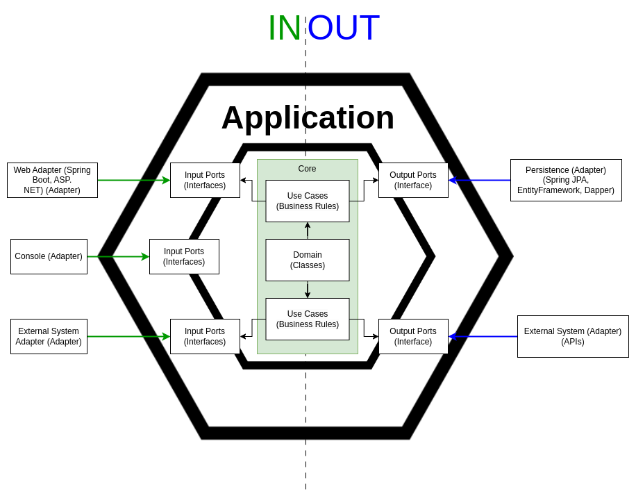
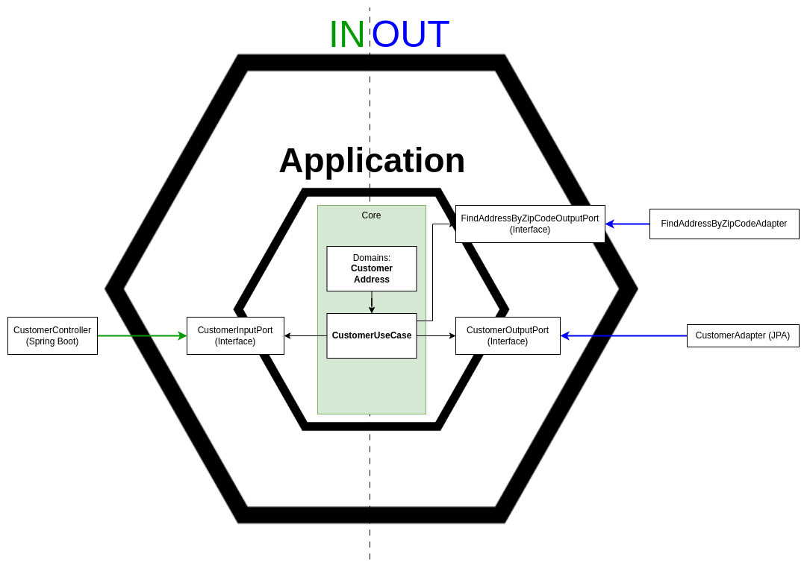

# 1. Hexagonal architecture

- Create your application to work without either a UI or a database so you can run automated regression-tests against the application, work when the database becomes unavailable, and link applications together without any user involvement. [Dr. Alistair Cockburn](https://alistair.cockburn.us/hexagonal-architecture/)

# 2. Architecture

- 

# 3. Pratical diagram

- 
